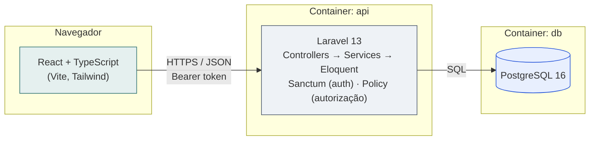

# Solicitações de Atendimento — V-Lab

Aplicação full stack para registrar, consultar, filtrar e atualizar
solicitações de atendimento em unidades públicas de saúde. Desenvolvida
como desafio técnico de seleção V-Lab/CIn (perfil: bolsista).

Todos os dados utilizados (nomes, protocolos, justificativas) são
fictícios, conforme exigido pelo desafio.

## Sumário

- [Tecnologias e versões](#tecnologias-e-versões)
- [Como executar](#como-executar)
- [Como executar os testes](#como-executar-os-testes)
- [Especificação da API (OpenAPI)](#especificação-da-api-openapi)
- [Arquitetura](#arquitetura)
- [Decisões arquiteturais](#decisões-arquiteturais)
- [Funcionalidades](#funcionalidades)
- [Uso de inteligência artificial](#uso-de-inteligência-artificial)

## Tecnologias e versões

| Camada | Tecnologia | Versão |
|---|---|---|
| Frontend | React + TypeScript | React 19, TS 5.x |
| Frontend | Vite | 8.x |
| Frontend | Tailwind CSS | 4.x |
| Backend | PHP | 8.4 |
| Backend | Laravel | 13.x |
| Backend | Laravel Sanctum | — (autenticação por token) |
| Banco de dados | PostgreSQL | 16 (alpine) |
| Infraestrutura | Docker / Docker Compose | — |

Bibliotecas complementares do frontend, e por que cada uma foi usada:

- **react-router-dom:** roteamento entre listagem, detalhe, criação e login.
- **axios:** cliente HTTP com interceptors centralizados (token e tratamento de erro).
- **react-hook-form + zod + @hookform/resolvers:** validação declarativa do formulário de criação, espelhando as regras do backend.
- **lucide-react:** ícones da interface.
- **vitest + @testing-library/react + @testing-library/user-event:** testes de componente.

## Como executar

Pré-requisitos: Docker e Docker Compose.

```bash
git clone <url-do-repositorio>
cd desafio-vlab-solicitacoes
cp .env.example .env
docker compose up --build
```

Isso sobe três serviços integrados:

- **PostgreSQL:** `localhost:5432`
- **API (Laravel):** `http://localhost:8000` -> roda migrations e seeders automaticamente na inicialização (ver `backend/docker/entrypoint.sh`)
- **Frontend (React):** `http://localhost:5173`

Usuários fictícios já disponíveis após o seed (senha para ambos: `senha123`):

| E-mail | Perfil |
|---|---|
| `operador@example.com` | OPERADOR |
| `admin@example.com` | ADMINISTRADOR |

Para rodar o frontend fora do container:

```bash
cd frontend
cp .env.example .env
npm install
npm run dev
```

### Resetar o ambiente do zero

```bash
docker compose down -v
docker compose up --build
```

## Como executar os testes

**Backend** (dentro do container, ou com PHP/Composer instalados localmente):

```bash
docker compose exec api php artisan test
```

15 testes cobrindo: a máquina de transições de status (unitário, sem banco), criação de solicitação, validação condicional de `justificativa_prioridade`, autenticação (401 sem token), e autorização por perfil (403 para operador tentando cancelar, 200 para administrador).

**Frontend**:

```bash
cd frontend
npm test
```

4 testes cobrindo a mesma regra de justificativa obrigatória (no client-side) e a ocultação do botão de cancelar para usuários não-administradores.

## Especificação da API (OpenAPI)

A especificação completa está em [`docs/openapi.yaml`](docs/openapi.yaml), a qual
inclui todos os endpoints implementados, parâmetros de filtro, corpos de
requisição, respostas de sucesso, erros de validação e os principais
códigos HTTP utilizados (200, 201, 204, 401, 403, 404, 409, 422, 503).

Para visualizar de forma navegável, cole o conteúdo do arquivo em
[editor.swagger.io](https://editor.swagger.io) ou abra com a extensão
OpenAPI do seu editor.

## Arquitetura



Frontend e backend são desacoplados por uma API REST versionada
(`/api/v1`); nenhum dado estático substitui a integração real, ou seja, o
frontend consome exclusivamente a API para todas as operações do
desafio.

**Evolução futura**: se o domínio crescesse para incluir múltiplos
módulos de saúde pública (agendamento de exames, prontuário, etc.), o
próximo passo natural seria extrair `SolicitacaoService` para um
serviço de domínio próprio, comunicando-se com os demais por eventos
de domínio ou por uma fila (Laravel Queues), preparando o terreno para
uma arquitetura de serviços. Isso não foi feito agora porque o domínio
atual (uma única entidade, um único fluxo) não demonstra essa
necessidade.

## Decisões arquiteturais

Esta seção documenta as escolhas mais relevantes e por quê, incluindo
algumas revertidas conscientemente durante o desenvolvimento.

### Backend

- **Enum PHP como fonte única da máquina de status.** `StatusSolicitacao::proximosPermitidos()` centraliza toda a tabela de transições do edital (item 2.3-B) em uma função `match` exaustiva. Testado isoladamente, sem banco, em `StatusSolicitacaoTest`.
- **Um único `Service`, não um Repository.** `SolicitacaoService` concentra geração de protocolo e transição de status. Não há camada de Repository porque o Eloquent já é a camada de acesso a dados — um repositório que só delegasse para o Eloquent seria abstração sem benefício demonstrável (o próprio edital, item 2.4-A, avisa sobre isso).
- **`CHECK constraint` em vez de `ENUM` nativo do PostgreSQL** para `categoria`, `prioridade`, `status` e para a regra "URGENTE exige justificativa". Alterar um tipo `ENUM` do Postgres exige DDL incômodo; um `CHECK` é uma migration simples. A validação forte já ocorre no Form Request — o banco é a última linha de defesa (defesa em profundidade).
- **409 para transição de status inválida, 422 para erro de validação de formato.** Uma transição de RECEBIDA para CONCLUIDA é um corpo de requisição sintaticamente válido, mas semanticamente incompatível com o estado atual do recurso, por isso 409 (conflito), e não 422.
- **Laravel Sanctum**, não Passport nem JWT manual, pois é a opção recomendada pelo próprio Laravel para uma SPA consumindo sua própria API, sem a complexidade de um fluxo OAuth completo.
- **Autenticação e autorização por perfil (bônus, item 2.5)**, com escopo deliberadamente enxuto: dois perfis fixos (OPERADOR, ADMINISTRADOR), populados via seeder, sem tela de cadastro. A única ação restrita por `SolicitacaoPolicy` é o cancelamento, que é a única transição irreversível do fluxo, e por isso a única que justifica uma trava de autorização real.
- **Health check + middleware de correlação de requisições** (bônus, item 2.5): `GET /api/v1/health` verifica a conexão com o Postgres; todo request recebe um `X-Request-Id` (gerado ou propagado) incluído no contexto de log, facilitando diagnóstico caso algo falhe durante a avaliação.
- **Script de inicialização do banco de testes em `backend/docker/`, não em uma pasta `infra/` própria.** É consumido exclusivamente pela suíte de testes do Laravel; criar uma pasta de infraestrutura genérica para um único arquivo pareceu desproporcional.

### Frontend

- **Organização por domínio (`features/`), não por tipo de arquivo.** `features/solicitacoes/` e `features/auth/` concentram tipos, chamadas de API, hooks, componentes e páginas de cada domínio. `components/ui/` e `components/layout/` guardam apenas peças genéricas sem regra de negócio.
- **Componentes de guarda de autenticação (`RequireAuth`, `SoAdmin`) dentro de `features/auth/components/`**, não em uma pasta `components/` separada, são acoplados ao domínio de autenticação (consomem `AuthContext` diretamente), então a organização por domínio prevalece sobre separação por "tipo de componente".
- **Tipos manuais espelhando os Resources do backend** (`features/solicitacoes/types.ts`, `features/auth/types.ts`), com union types literais (`Status`, `Categoria`, `Prioridade`) em vez de `string` solto, porqueo TypeScript acusa erro em tempo de compilação se um valor inválido for usado, e nenhum `any` é usado no projeto.
- **Autorização espelhada na UI, nunca substituindo o backend.** `SoAdmin` esconde o botão de cancelamento para quem não é administrador — é conveniência de UX. A autorização real está em `SolicitacaoPolicy`, no backend. Então, mesmo que alguém force a chamada via DevTools, o backend recusa com 403.
- **`react-hook-form` + `zod`** para o formulário de criação, com schema (`novaSolicitacaoSchema.ts`) que replica deliberadamente as regras do `StoreSolicitacaoRequest` do backend, inclusive a exigência condicional de justificativa para prioridade URGENTE.
- **Paleta de cores e tipografia deliberadas:** tom teal sóbrio como cor primária (calma, adequado a um contexto de saúde pública) e vermelho/laranja saturado reservados apenas para os estados que pedem atenção real (URGENTE, CANCELADA). Tipografia IBM Plex Sans/Mono.

## Funcionalidades

### Implementadas

- CRUD parcial completo: criação, listagem (paginada, com filtros por status/categoria/prioridade), consulta de detalhe e atualização de status.
- Máquina de transição de status respeitando integralmente o fluxo do edital.
- Validação de `justificativa_prioridade` obrigatória para prioridade URGENTE, no backend e no frontend.
- Autenticação por token (Sanctum) e autorização por perfil (cancelamento restrito a administradores).
- Estados de carregamento, sucesso, vazio e erro em todas as telas assíncronas.
- Responsividade (tabela vira lista em telas pequenas) e acessibilidade básica (labels associados, `aria-invalid`/`aria-describedby` em erros de formulário, foco visível).
- Health check da API e correlação de requisições via `X-Request-Id`.
- Testes automatizados: 15 no backend (PHPUnit), 4 no frontend (Vitest + Testing Library).
- Pipeline de CI (GitHub Actions) rodando lint, testes e build de backend e frontend a cada push.

### Não implementadas / limitações conhecidas

- **Sem tela de cadastro de usuários:** Os dois perfis são fixos, criados via seeder. Decisão deliberada para manter o escopo de autenticação enxuto — o edital trata autenticação como diferencial bônus (item 2.5), não requisito eliminatório.
- **Sem paginação "infinita" ou busca textual livre:** apenas os filtros exigidos pelo edital (status, categoria, prioridade).
- **Sem soft delete nem histórico de alterações de status:** a tabela guarda apenas o estado atual; um histórico de auditoria seria uma extensão natural, mas não foi pedido pelo desafio.
- **Sem processamento assíncrono (filas/eventos):** deliberadamente não implementado; o domínio atual não tem nenhuma operação genuinamente lenta ou que se beneficie de desacoplamento, e introduzir uma fila sem essa necessidade real seria abstração sem utilidade demonstrável (o próprio edital adverte sobre isso).

## Uso de inteligência artificial