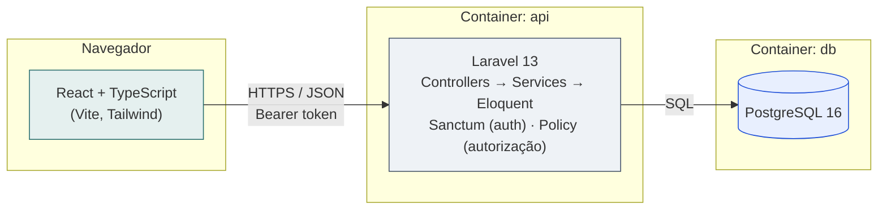

# Solicitações de Atendimento — V-Lab

Aplicação full stack para registrar, consultar, filtrar e atualizar
solicitações de atendimento em unidades públicas de saúde. Desafio técnico
de seleção V-Lab/CIn (perfil: bolsista). Todos os dados usados são fictícios.

## Sumário

- [Tecnologias e versões](#tecnologias-e-versões)
- [Como executar](#como-executar)
- [Como executar os testes](#como-executar-os-testes)
- [Especificação da API (OpenAPI)](#especificação-da-api-openapi)
- [Arquitetura](#arquitetura)
- [Estrutura de pastas](#estrutura-de-pastas)
- [Decisões arquiteturais](#decisões-arquiteturais)
- [Funcionalidades](#funcionalidades)
- [Uso de inteligência artificial](#uso-de-inteligência-artificial)

## Tecnologias e versões

| Camada | Tecnologia | Versão |
|---|---|---|
| Frontend | React + TypeScript | React 19, TS 5.x |
| Frontend | Vite | 8.x |
| Frontend | Tailwind CSS | 4.x |
| Backend | PHP | 8.4 |
| Backend | Laravel | 13.x |
| Backend | Laravel Sanctum | autenticação por token |
| Banco de dados | PostgreSQL | 16 (alpine) |
| Infraestrutura | Docker / Docker Compose | — |

Bibliotecas complementares do frontend: `react-router-dom` (roteamento),
`axios` (cliente HTTP), `react-hook-form` + `zod` (validação de
formulários), `lucide-react` (ícones), `vitest` + Testing Library (testes).

## Como executar

Pré-requisitos: Docker e Docker Compose.

```bash
git clone <url-do-repositorio>
cd desafio-vlab-solicitacoes
cp .env.example .env
docker compose up --build
```

Sobe três serviços: PostgreSQL (`:5432`), API Laravel (`:8000`, migrations
e seeders automáticos) e frontend React (`:5173`).

Usuários fictícios já disponíveis após o seed (senha para ambos: `senha123`):

| E-mail | Perfil |
|---|---|
| `operador@example.com` | OPERADOR |
| `admin@example.com` | ADMINISTRADOR |

Logando como `admin@example.com`, aparecem os links **"Usuários"** e
**"Cadastrar usuário"** no cabeçalho (o cadastro não é público).

Para rodar o frontend fora do container: `cd frontend && cp .env.example .env && npm install && npm run dev`.

Para resetar o ambiente do zero: `docker compose down -v && docker compose up --build`.

## Como executar os testes

**Backend:** `docker compose exec api php artisan test`
— 23 testes: máquina de transições de status, criação de solicitação,
validação condicional de justificativa, autenticação, autorização por
perfil, cadastro/listagem de usuários e resumo por status/prioridade.

**Frontend:** `cd frontend && npm test`
— 6 testes: validação client-side, ocultação de ações por perfil, guarda
de rota administrativa.

## Especificação da API (OpenAPI)

Especificação completa em [`docs/openapi.yaml`](docs/openapi.yaml): todos os
endpoints, parâmetros de filtro, corpos de requisição, respostas de sucesso,
erros de validação e códigos HTTP (200, 201, 204, 401, 403, 404, 409, 422, 503).
Para visualizar, cole o conteúdo em [editor.swagger.io](https://editor.swagger.io).

## Arquitetura



Frontend e backend são desacoplados por uma API REST versionada (`/api/v1`);
nenhum dado estático substitui a integração real.

**Evolução futura:** se o domínio crescesse (agendamento, prontuário etc.),
o próximo passo seria extrair `SolicitacaoService` para um serviço de domínio
próprio, comunicando-se por eventos ou fila, o que não foi feito agora porque o domínio
atual não demonstra essa necessidade.

## Estrutura de pastas

<details>
<summary><strong>backend/</strong> (Laravel)</summary>
backend/
├── app/
│ ├── Enums/ # CategoriaSolicitacao, PrioridadeSolicitacao, StatusSolicitacao, PerfilUsuario
│ ├── Exceptions/ # TransicaoStatusInvalidaException
│ ├── Http/
│ │ ├── Controllers/ # AuthController, HealthController, SolicitacaoController, UserController
│ │ ├── Middleware/ # AssignRequestId (correlação de requisições)
│ │ ├── Requests/ # StoreSolicitacaoRequest, AtualizarStatusRequest, ListarSolicitacoesRequest, StoreUserRequest
│ │ └── Resources/ # SolicitacaoResource, UserResource
│ ├── Logging/ # JsonLogFormatter
│ ├── Models/ # Solicitacao, User
│ ├── Policies/ # SolicitacaoPolicy, UserPolicy
│ └── Services/ # SolicitacaoService (regras de negócio)
├── database/
│ ├── factories/
│ ├── migrations/
│ └── seeders/
├── docker/
│ ├── entrypoint.sh # aguarda o Postgres, roda migrations + seed
│ └── init-test-db.sql # cria o banco de teste isolado
├── routes/api.php
├── tests/
│ ├── Feature/ # AtualizarStatusTest, CadastrarUsuarioTest, CriarSolicitacaoTest, ListarUsuariosTest, ResumoSolicitacoesTest
│ ├── Unit/ # StatusSolicitacaoTest
│ ├── TestCase.php # trava de segurança: aborta se o banco não for de teste
│ └── bootstrap.php # corrige $_SERVER para isolar o banco de teste (só DB_DATABASE e APP_ENV)
├── Dockerfile
└── phpunit.xml
</details>

<details>
<summary><strong>frontend/src/</strong> (React)</summary>
frontend/src/
├── components/
│ ├── layout/AppShell.tsx
│ └── ui/ # Button, Select, PasswordInput, Spinner, EmptyState, ErrorState
├── features/
│ ├── auth/
│ │ ├── AuthContext.tsx, context.ts, useAuth.ts, useUsuarios.ts
│ │ ├── api.ts, types.ts, registrarUsuarioSchema.ts
│ │ ├── components/ # RequireAuth, SoAdmin, RegistrarUsuarioForm
│ │ └── pages/ # LoginPage, RegistrarUsuarioPage, UsuariosPage
│ └── solicitacoes/
│ ├── api.ts, types.ts, novaSolicitacaoSchema.ts
│ ├── components/ # SolicitacaoForm, SolicitacaoTable, ResumoSolicitacoes, FiltrosSolicitacoesForm, Paginacao, badges
│ ├── hooks/ # useSolicitacao, useSolicitacoes, useResumoSolicitacoes
│ └── pages/ # ListaPage, DetalhePage, NovaSolicitacaoPage
├── lib/ # http.ts (cliente HTTP), formatters.ts
├── App.tsx, main.tsx
</details>

## Decisões arquiteturais

Escolhas mais relevantes e por quê, incluindo algumas revertidas
conscientemente durante o desenvolvimento.

**Backend**

- Enum `StatusSolicitacao` centraliza a máquina de transições, testada sem banco (`StatusSolicitacaoTest`).
- Sem Repository: Eloquent já é a camada de dados; um Repository que só delegasse seria abstração sem ganho.
- `CHECK constraint` em vez de `ENUM` nativo do Postgres, migration mais simples de alterar; validação forte já ocorre no Form Request.
- 409 para transição de status inválida, 422 para erro de validação de formato.
- Sanctum (não Passport/JWT manual): opção recomendada pelo Laravel para SPA consumindo a própria API.
- Dois perfis fixos (OPERADOR/ADMINISTRADOR); `SolicitacaoPolicy` restringe cancelamento, `UserPolicy` restringe cadastro de usuários.
- Cadastro de usuário só por administrador, não é autocadastro público: `Solicitacao` não tem vínculo com usuário autenticado — é um sistema de equipe interna, não um portal de autoatendimento.
- Health check (`/health`) + `X-Request-Id` em todo request, propagado nos logs.
- `GET /solicitacoes/resumo` como endpoint dedicado, em vez de calcular o resumo no frontend a partir da página carregada — a tela inicial pagina os resultados (6 por página), então contar a partir do que está na tela daria números errados; o resumo precisa da contagem real de todas as solicitações.
- `tests/bootstrap.php` + trava em `tests/TestCase.php`: o `docker-compose.yml` injeta `DB_DATABASE` diretamente no ambiente do container, e isso vaza para `$_SERVER` de um jeito que nem `phpunit.xml` sozinho resolve, o bootstrap corrige isso, e a trava impede qualquer migration de teste rodar contra o banco de desenvolvimento caso o problema volte.

**Frontend**

- Organização por domínio (`features/`), não por tipo de arquivo; `components/` só guarda peças genéricas.
- `SoAdmin` tem prop `aoNegar` (padrão: esconde; em rotas administrativas, `/usuarios` e `/usuarios/novo`, redireciona) evita duplicar a checagem de perfil em dois componentes.
- Tipos manuais espelhando os Resources do backend, com union types em vez de `string` solto.
- Autorização espelhada na UI é só UX; a autorização real está no backend.
- `react-hook-form` + `zod`, com schemas espelhando as regras de validação do backend.
- `react-hooks/set-state-in-effect` rebaixada a `warn` no ESLint: o padrão de fetch com cancelamento é o recomendado pelo próprio React; o projeto não usa React Compiler.

## Funcionalidades

### Implementadas

- CRUD parcial completo: criação, listagem paginada com filtros, detalhe, atualização de status.
- Máquina de transição de status respeitando o fluxo do edital.
- Validação de `justificativa_prioridade` obrigatória para URGENTE, no backend e no frontend.
- Autenticação por token e autorização por perfil (cancelamento e cadastro de usuários restritos a administradores).
- Tela inicial com resumo de solicitações por status e por prioridade (contagem total, não só da página atual).
- Cadastro e listagem de usuários (por administrador), com opção de mostrar/ocultar senha no login e no cadastro.
- Estados de carregamento, sucesso, vazio e erro em todas as telas assíncronas.
- Responsividade e acessibilidade básica (labels, `aria-invalid`, foco visível).
- Health check da API e correlação de requisições via `X-Request-Id`.
- Testes automatizados: 23 no backend, 6 no frontend.
- Pipeline de CI (GitHub Actions) rodando lint, testes e build.

### Não implementadas / limitações conhecidas

- Sem paginação "infinita" ou busca textual livre, só os filtros exigidos pelo edital.
- Sem soft delete nem histórico de alterações de status.
- Sem processamento assíncrono (filas/eventos), o domínio atual não tem operação que se beneficie disso.

## Uso de inteligência artificial

O desenvolvimento contou com apoio do Claude (Anthropic) como ferramenta de
apoio, mais especificamente: usado na geração da estrutura inicial das pastas 
backend e frontend, na revisão de decisões de arquitetura, na geração dos testes (revisados e
ajustados manualmente), no diagnóstico de bugs de configuração de ambiente
(Docker, isolamento do banco de dados de testes) e na documentação do
projeto (README, especificação OpenAPI).

Todo o código gerado foi lido, testado localmente e compreendido antes de
aceito pela candidata.